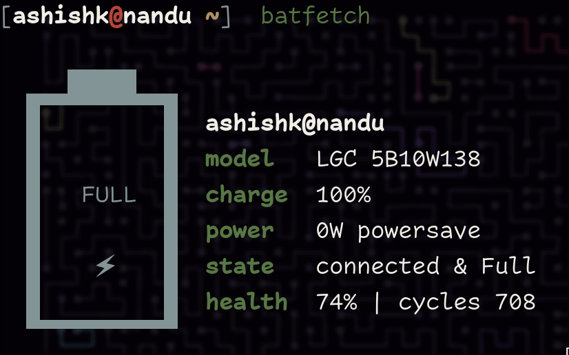

<div align="center">

A super tiny battery information fetch script written in BASH

<a href='#'></img><a/>
<a href='#'></img><a/>
<a href='#'></img><a/>

</div>

# Batfetch

BatFetch is a command-line tool that displays detailed information about the battery of your device in a clean and organized way. The tool is inspired by pfetch, a popular command-line system information tool.

It provides information about the battery model, current charge level, power state, and health status. The tool also displays an ASCII art title that adds a touch of fun to the output.

## Usage:

#### Basic usage:

```
batfetch
```

#### JSON Output:

To obtain detailed information in JSON format, use the -j or --json flag.
Note that this feature requires the installation of jq on your system.

```
batfetch -j
# or
batfetch --json
```

Make sure to install jq for the JSON output functionality:

```
# On arch based systems*
yay -S jq

# On Debian-based systems
sudo apt-get install jq

# On Red Hat-based systems
sudo yum install jq
```



## Installation:

#### AUR:

```
yay -S batfetch
```

## For manual instalation:

#### To install run

```
    git clone https://github.com/ashish-kus/batfetch
    cd batfetch
    sudo make install
```

#### To uninstall run

```
    git clone https://github.com/ashish-kus/batfetch
    cd batfetch
    sudo make uninstall
```

#### Nix os (via Flake)

> [!NOTE]: This will run the command without installation of the tool.

```
nix run github:ashish-kus/batfetch
```

> [!NOTE:] Using flake to install in the system.

```bash
# flake input
batfetch = {
  url = "github:ashish-kus/batfetch";
  inputs.nixpkgs.follows = "nixpkgs";
};

environment.systemPackages = [
  inputs.batfetch.packages.${pkgs.system}.default
];
```

#### LICENCE

<center>
	GNU GENERAL PUBLIC LICENCE
	version 3, 29 June 2007
</center>

Copyright (C) 2007 Free Software Foundation, Inc. <https://fsf.org/> Everyone is permitted to copy and distribute verbatim copies of this license document, but changing it is not allowed.
